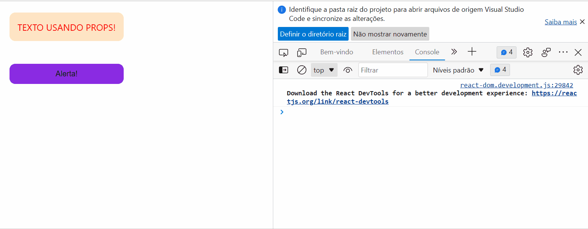

# Quest React básico

Esta quest do curso Devquest dos irmãos [Dev em Dobro](https://www.youtube.com/@DevemDobro) tem por objetivos:
1. usar o React para criar um parágrafo e, usando as *props*, alterar sua cor para **vermelho** e o modo das letras para *uppercase* (maiúsculas), e;
2. criar um botão em que, ao clicá-lo, um alerta apareça contendo uma mensagem com o conteúdo da *prop label* inserida.

## Dificuldades 

A maior dificuldade foi ver até onde eu conseguia relembrar cada passo sem utilizar das anotações ou ter de reassistir as aulas, como uma forma de me desafiar e ver o quanto consegui absorver do conteúdo. Após a revisão pelas anotações e as aulas, pude corrigir alguns erros. Eis o resultado final!  